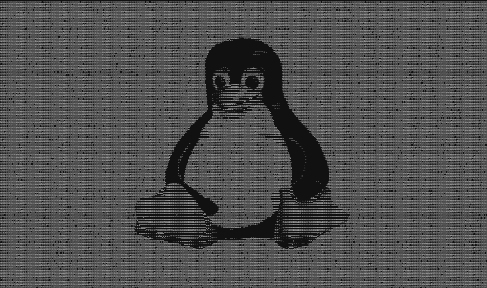
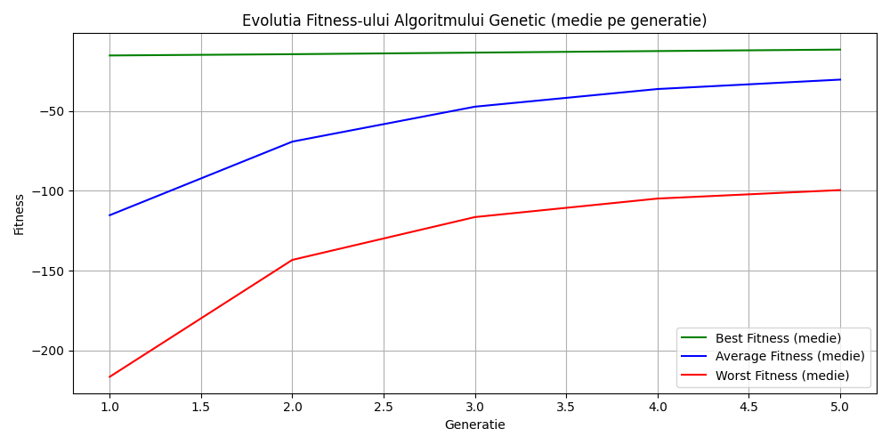

# ASCII Art Genetic

A tool for converting images to ASCII Art using genetic algorithms and analyzing fitness evolution.

## Overview

This project transforms any image into an ASCII Art representation, using a genetic algorithm to select the best characters for bright areas. It allows fitness evolution analysis and visualization of intermediate results.

## ASCII Art Genetic: Technologies & Dependencies

The tool uses several Python libraries for image processing, analysis, and visualization.

## Core Technologies Table

| Category         | Technology   | Package/Module | Purpose                                  |
|------------------|--------------|----------------|------------------------------------------|
| **Image Processing** | Pillow    | `PIL`          | Image manipulation and processing        |
|                  | NumPy        | `numpy`        | Numeric operations and arrays            |
| **Visualization**| Matplotlib   | `matplotlib`   | Plotting fitness evolution graphs        |
| **CLI & Files**  | Argparse     | `argparse`     | Command-line arguments                   |
|                  | OS           | `os`           | File and directory operations            |
| **Algorithms**   | Random       | `random`       | Mutation and random selection            |
| **Other**        | sys          | `sys`          | Argument access and program exit         |

## Requirements

### Python Dependencies

```bash
pip install pillow numpy matplotlib
```

## Usage

### Example Run

```bash
python main.py image.jpg --analyze --save --fitness --population 20 --generations 10
```

### Main Arguments

- `--analyze` analyzes the impact of the brightness threshold
- `--save` saves processed images (grayscale, binary)
- `--fitness` generates the fitness evolution graph
- `--population N` sets the population size for the genetic algorithm
- `--generations N` sets the number of generations for the genetic algorithm

## Visual Examples

<p align="center">
  
  
    
</p>

### Fitness Evolution

<p align="center">
  
</p>

## How It Works

1. **Tile Splitting:** The image is divided into small blocks (tiles) of pixels.
2. **ASCII Character Selection:** For each tile, brightness is calculated and a suitable ASCII character is chosen. In bright areas, a genetic algorithm is used to optimize the character selection.
3. **Genetic Algorithm:** For each bright tile, a population of characters evolves over several generations, selecting the best character based on a fitness function.
4. **Fitness:** The fitness function measures how well the chosen character approximates the original tile's intensity.
5. **Analysis & Visualization:** Intermediate images can be saved and the fitness evolution can be visualized across generations.

## Output Structure

- `output.txt` - The generated ASCII Art
- `output/<name>_processed.png` - processed image
- `output/<name>_grayscale.png` - grayscale version
- `output/<name>_binary.png` - binary version
- `output/<name>_fitness_evolution.png` - fitness evolution graph

## Resources

- [Hands-On-Genetic-Algorithms-with-Python](https://github.com/PacktPublishing/Hands-On-Genetic-Algorithms-with-Python-Second-Edition)
- [Pillow Documentation](https://pillow.readthedocs.io/)
- [Matplotlib Documentation](https://matplotlib.org/stable/users/index.html)
